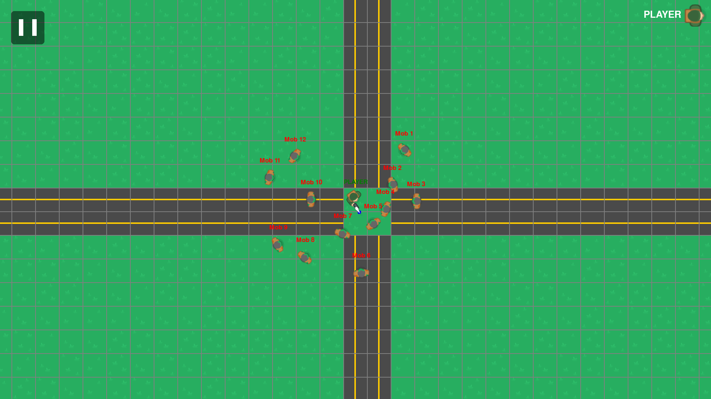
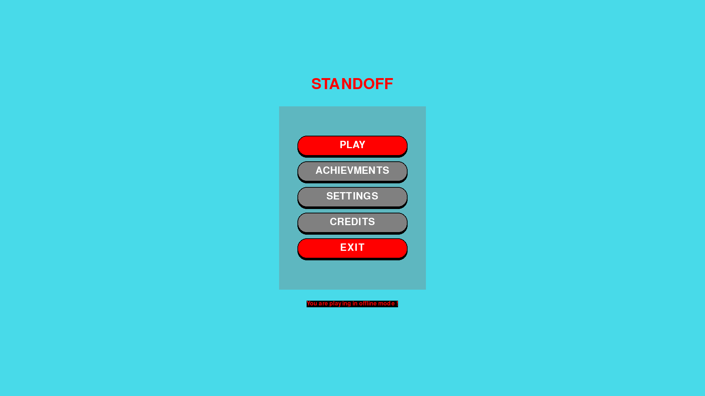
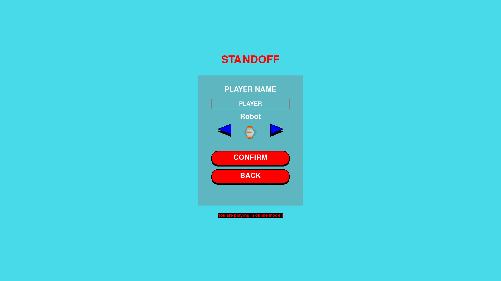

# Standoff


Standoff is a 2D networked multiplayer top-down shooter built with [pygame-ce](https://github.com/pygame-community/pygame-ce). Pick a character, host or join a room over the network (or play offline), then move, aim, and shoot your way through waves of zombies on a Tiled-authored map.



## Gameplay

Enter a name, pick one of **8 characters**, then choose how to play:

- **New Game** — play offline on your own.
- **Create Room** — host an online room others can join (up to **4 players**).
- **Connect** — join an existing room by its room ID.

Players and zombies start with **100 HP**. Zombies home in on the nearest player (falling back to your base when out of range); shooting kicks back and emits a muzzle flash. The camera follows your player around the map.

### Screenshots

| Main menu | Character select | Gameplay |
|-----------|------------------|----------|
|  |  |  |

### Characters

`hitman` · `man_blue` · `man_brown` · `man_old` · `robot` · `solider` · `survivor` · `woman_green`

### Controls

| Action | Input |
|---|---|
| Move | `W` `A` `S` `D` or arrow keys |
| Aim | Mouse |
| Shoot | Left click (hold to auto-fire) |
| Back / menu | `Esc` |
| Toggle debug overlay | `F1` |
| Toggle fullscreen | `F11` |

## Multiplayer

The host runs a dedicated server window:

```bash
uv run python server.py     # or: scripts/server.bat
```

Clients launch the game, **Create Room** (host) or **Connect** by room ID (others). On the same LAN, clients connect directly to the host's IP. For play over the internet you'll need to reach the server's TCP port from outside — a mesh VPN like [Tailscale](https://tailscale.com/) (stable, encrypted, no port‑forwarding), a game‑oriented tunnel like [playit.gg](https://playit.gg/), or router port‑forwarding. (A TCP tunnel such as `ngrok` works too, but its free tier hands out a new address each session — fetch it yourself; it's no longer committed to the repo.)

## Download

[](https://umutcanekinci.itch.io/standoff)

Grab a ready-to-play desktop build for your OS from [itch.io](https://umutcanekinci.itch.io/standoff) or the [latest GitHub release](https://github.com/umutcanekinci/standoff/releases/latest) — no Python required. Unzip and run:

| OS | Run |
|----|-----|
| Windows | Extract `standoff-windows.zip`, run `standoff.exe` |
| macOS | Extract `standoff-macos.zip`, open `Standoff.app` |
| Linux | Extract `standoff-linux.zip`, run `./standoff/standoff` |

> macOS Gatekeeper: the app is unsigned, so the first launch needs **right-click → Open** (or `xattr -dr com.apple.quarantine Standoff.app`).
>
> Windows SmartScreen: the app is unsigned, so the first launch shows **"Windows protected your PC."** Click **More info → Run anyway**. This is Microsoft's download-reputation check, not a virus warning — brand-new unsigned executables always trigger it.

An Android debug APK is also built on every release — see [`.github/workflows/android.yml`](.github/workflows/android.yml) — but it's a CI artifact only, not yet attached to Releases or itch.io.

## Requirements (from source)

- Python 3.12+
- [pygame-ce](https://github.com/pygame-community/pygame-ce), colorama, pyyaml, pytmx (resolved automatically from `pyproject.toml` / `uv.lock`)
- [uv](https://docs.astral.sh/uv/) (optional but recommended)

## Running

```bash
git clone --recurse-submodules https://github.com/umutcanekinci/standoff.git
cd standoff
uv sync
uv run python __main__.py
```

If you forgot `--recurse-submodules`: `git submodule update --init`.

Without `uv`: `pip install .` then `python __main__.py` (Windows: `scripts/Standoff.bat`).

## Building a standalone desktop bundle

Desktop builds are produced by [PyInstaller](https://pyinstaller.org/) from `standoff.spec`, which bundles `assets/` and `config/` alongside the executable (onedir) and excludes the tkinter-based server. To build locally for your current OS:

```bash
uv sync --group build
uv run pyinstaller standoff.spec --noconfirm
```

The result lands in `dist/standoff/` (`dist/Standoff.app` on macOS).

### Cutting a desktop release

Per-OS bundles for Windows, macOS, and Linux are built and published automatically by [`.github/workflows/release.yml`](.github/workflows/release.yml) when a version tag is pushed:

```bash
git tag v0.1.0
git push origin v0.1.0
```

The desktop workflow also pushes each OS build to its [itch.io](https://umutcanekinci.itch.io/standoff) channel via [Butler](https://itch.io/docs/butler/). The same tag also triggers [`.github/workflows/android.yml`](.github/workflows/android.yml), which builds a debug APK as a separate CI artifact (not attached to the Release or to itch.io). Use either workflow's **Run workflow** button to test a build without publishing.

## Project layout

```
__main__.py            Entry point — injects src/ + src/pygame_core/ into sys.path
server.py              Dedicated multiplayer server (Tk window)
src/app/game.py        Game class — owns the active scene + network client, drives the loop
src/app/scene.py       Scene base — the per-frame handle_event/update/draw contract
src/app/lobby_scene.py LobbyScene — menus, character select, room create/join
src/app/gameplay_scene.py  GameplayScene — the in-world arena, entities, camera, game loop
src/gameplay/          Entities (player, mob, bullet), map, camera, collision
src/net/               Client + server networking, room / player state, protocol commands
src/ui/                Panel widgets (vector buttons, text input)
src/util/              Constants, database helper
src/pygame_core/       Engine submodule (Application, GameObject/ECS, PanelLoaderExt, ...)
config/                YAML: assets, panels
assets/                Images, Tiled maps
tests/                 Test suite — protocol/transport/game-server, unit → e2e
bench/                 Headless performance benchmarks (mob capacity)
scripts/               Windows launchers (Standoff.bat, server.bat, build-android.ps1)
tools/                 Build helpers (build_android.sh)
```

## Architecture

Standoff runs on the shared [`pygame_core`](https://github.com/umutcanekinci/pygame-core) engine: `Game` extends `pygame_core.Application`, the menus are panel-driven (`config/panels.yaml` + `PanelManager`), and in-world entities are `GameObject`s with `SpriteRenderer2D` components.

- **Scenes.** `Game` is a thin shell that holds the *active scene* and forwards `handle_event`/`update`/`draw` to it. `LobbyScene` owns all menu/panel state and the pre-game flow; `GameplayScene` owns the in-world phase. Switching phases swaps the active scene instead of branching on flags — a pause screen or game-over screen is a new `Scene` subclass, not another `if`.
- **The World.** `GameplayScene` *is* the world that entities depend on: `Player`, `Mob`, `Bullet`, `MuzzleFlash`, `Map` and `Obstacle` read their surroundings (walls, players, mobs, `delta_time`, camera, the mob grid, …) off that narrow surface rather than reaching into the whole `Game`.
- **Networking.** A game-agnostic transport (`BaseClient`/`BaseServer` + a pluggable `Protocol`/`Codec`) carries pickled messages. Both client (`Game.get_data`) and server (`GameServer._on_message`) dispatch through handler dicts keyed on the shared command names in `net/commands.py`, so the two sides can't silently drift apart.

## Testing

Tests are organized as a pyramid over the networking stack:

- **Unit** (`test_protocol.py`, `test_game_server.py`) — no sockets. Framing/codec edge cases and game-server command dispatch via fakes. Fast.
- **Integration** (`test_transport.py`, marked `integration`) — real `BaseClient`/`BaseServer` over loopback.
- **End-to-end** (`test_e2e.py`, marked `e2e`) — full `GameServer` + clients.

```bash
uv run --group dev pytest                              # everything
uv run --group dev pytest -m "not integration and not e2e"   # fast unit tests only
```

CI (GitHub Actions, `.github/workflows/tests.yml`) runs the **full** suite on every push and on PRs into `main`.

### Performance benchmark

`bench/bench_mobs.py` is a headless capacity benchmark — how many zombies the
simulation sustains before missing the 60 FPS frame budget. It times the per-frame
update (AI/physics) and draw separately for increasing mob counts:

```bash
uv run python bench/bench_mobs.py
```

Numbers are machine-relative — use them to compare before/after an optimization
on the same machine, not as an absolute FPS promise.

A [pre-commit](https://pre-commit.com/) hook runs ruff (lint + format) and the **fast** tests on each commit, leaving the socket-backed tests to CI. Enable it once per clone:

```bash
uv run pre-commit install
```

Bypass a hook run with `git commit --no-verify`; run all hooks manually with `uv run pre-commit run --all-files`.

## Credits

Character and tile art from [Kenney](https://www.kenney.nl/) — [Topdown Shooter](https://www.kenney.nl/assets/topdown-shooter). UI button sounds from [Kenney UI Pack](https://www.kenney.nl/assets/ui-pack).

## Contributing

1. Fork this repository.
2. Clone your fork: `git clone --recurse-submodules https://github.com/<you>/standoff.git`
3. Set up dev tooling: `uv sync` then `uv run pre-commit install` (runs lint/format + fast tests on commit).
4. Create a branch: `git checkout -b feature/<your-feature>`
5. Commit + push: `git commit -am "<message>" && git push origin feature/<your-feature>`
6. Open a pull request.

## Author

Umutcan Ekinci — [umutcannekinci@gmail.com](mailto:umutcannekinci@gmail.com)

See also the [contributors](https://github.com/umutcanekinci/standoff/contributors).

## License

See [LICENSE](LICENSE).
